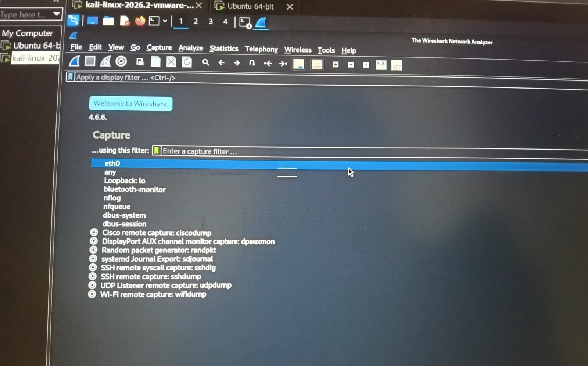
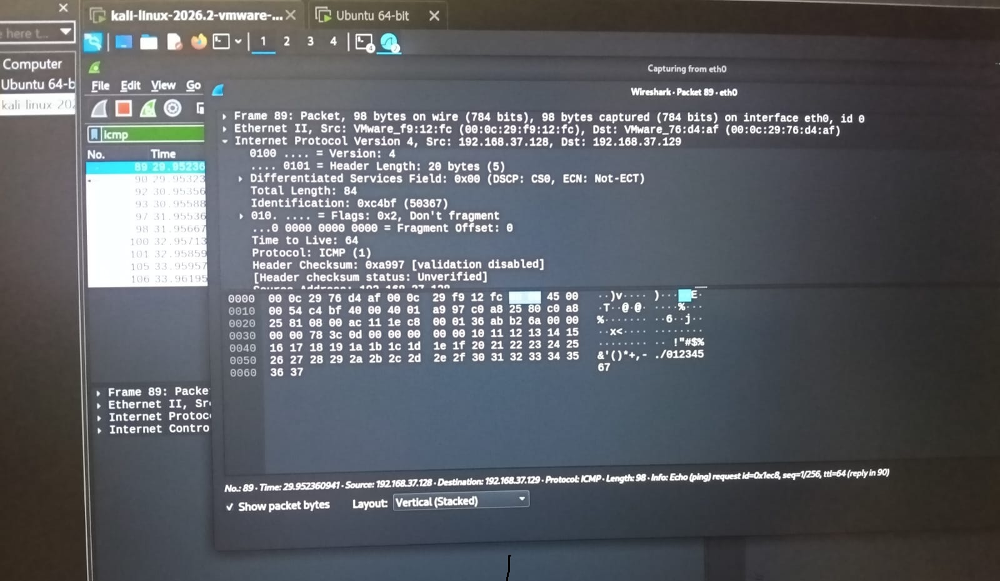
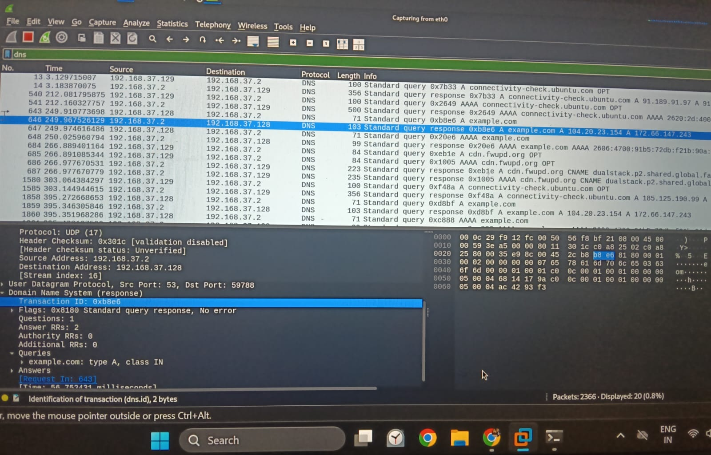
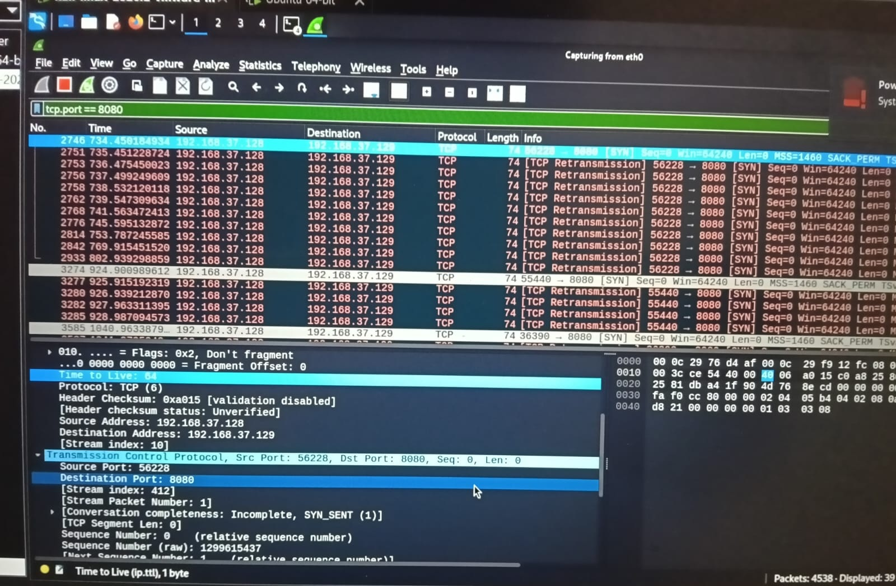
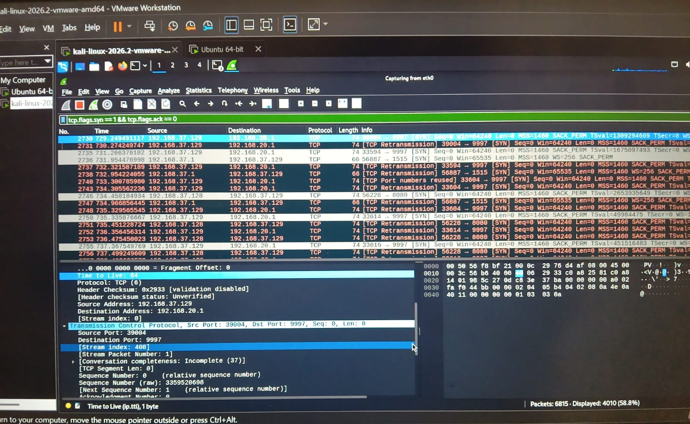

# Network Traffic Analysis & Suspicious Activity Detection Using Wireshark

## Overview

This project demonstrates network traffic capture and analysis using **Wireshark** in a controlled Kali Linux and Ubuntu virtual lab. Different types of network traffic were generated and analyzed to understand normal communication and identify suspicious reconnaissance activity.

## Objectives

* Capture and analyze network packets using Wireshark
* Analyze ICMP, DNS, HTTP and TCP traffic
* Identify source and destination IP addresses and ports
* Analyze TCP flags and network conversations
* Detect Nmap SYN scan activity

## Lab Environment

* **Kali Linux:** Traffic generation and security testing
* **Ubuntu:** Target/monitored system
* **Wireshark:** Packet capture and analysis
* **Nmap:** Network reconnaissance testing
* **VMware:** Virtual lab environment

## Traffic Analyzed

### ICMP Traffic

Used `ping` to generate ICMP packets and analyzed request and reply communication.

### DNS Traffic

Used `nslookup` to generate DNS queries and inspected DNS request and response packets.

### HTTP Traffic

Created a simple HTTP server on Ubuntu and analyzed TCP/HTTP communication from Kali.

### Nmap SYN Scan

Performed a controlled SYN scan from Kali against the Ubuntu lab machine and analyzed SYN packets in Wireshark to identify reconnaissance activity.

## Wireshark Filters

```text
icmp
```

```text
dns
```

```text
tcp.port == 8080
```

```text
tcp.flags.syn == 1 && tcp.flags.ack == 0
```

## Investigation Process

1. Started packet capture on the Kali `eth0` interface.
2. Generated ICMP, DNS and HTTP traffic.
3. Performed a controlled Nmap SYN scan against Ubuntu.
4. Applied Wireshark display filters.
5. Examined IP addresses, ports and TCP flags.
6. Identified SYN scan activity and collected screenshots as evidence.

## Evidence

### 1. Wireshark Packet Capture



### 2. ICMP Traffic Analysis



### 3. DNS Traffic Analysis



### 4. HTTP Traffic Analysis



### 5. Nmap SYN Scan Detection



## SOC Analyst Skills Demonstrated

* Network packet analysis
* Protocol identification
* TCP/IP analysis
* Reconnaissance detection
* Wireshark filtering
* Security investigation
* Evidence collection

> **Disclaimer:** All traffic generation and scanning activities were performed against systems inside a private VMware lab for learning purposes.
 for learning purposes.

